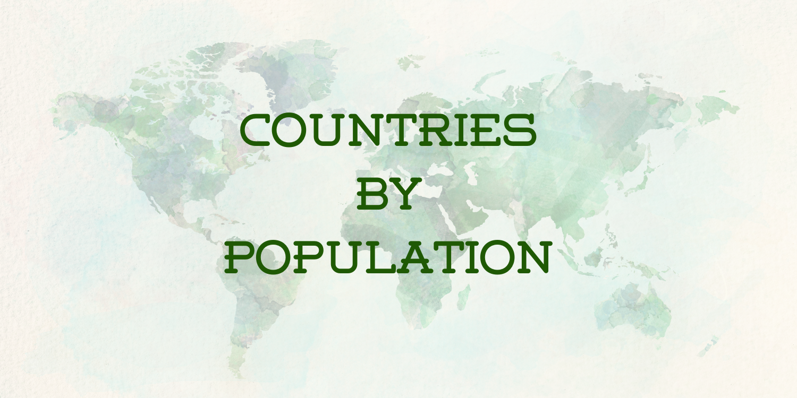

# Proyecto_Countries_by_population

## Contexto y rol a desarrollar

Los datos de población de las Naciones Unidas son un conjunto de datos que contiene información sobre la población estimada de cada país del mundo para varios años entre 1980 y 2050. El conjunto de datos incluye las siguientes columnas

- place: Nombre del país o región
- pop1980: Población estimada para el año 1980
- pop2000: Población estimada para el año 2000
- pop2010: Población estimada para el año 2010
- pop2022: población estimada para el año 2022
- pop2023: Población estimada para el año 2023
- pop2030: población estimada para el año 2030
- pop2050: Población estimada para el año 2050
- country: Código ISO 3166-1 alfa-3 del país
- area: Superficie total terrestre y acuática del país (en kilómetros cuadrados)
- landAreaKm: Superficie terrestre del país (en kilómetros cuadrados)
- cca2: Código ISO 3166-1 alfa-2 del país
- cca3: Código ISO 3166-1 alpha-3 del país
- netChange: Variación neta anual de la población (en miles)
- growthRate: Tasa de crecimiento anual de la población (en porcentaje)
- worldPercentage: Porcentaje de la población mundial
- density: Densidad de población (en personas por kilómetro cuadrado)
- densidadMi: Densidad de población (en personas por kilómetro cuadrado)
- rank: Rango del país por población

El dataset proporciona una visión global de la población de cada país a lo largo del tiempo y puede utilizarse para analizar tendencias demográficas, realizar proyecciones de población y comparar la población de distintos países. El conjunto de datos también puede utilizarse en combinación con otras fuentes de datos para explorar las correlaciones entre la población y diversos indicadores sociales y económicos.

## Propuesta de trabajo (indicaciones)

- Carga de los distintos datasets
- Explorarlos antes de cargarlos en python con pandas 
- Realizar un EDA en cada uno de los datasets 
- Realizar los gráficos que ayuden al análisis de la data

No hay límite de tiempo y mucho se deja a la creatividad de cada persona, así que no se limiten ni restringan en lo que pueden o no hacer.

## Habilidades técnicas esperadas 

Analisis de datos ingestados

Transformacion correcta de los archivos

Análisis de los datos transformados mediante gráficos

## Dataset

Por cuestiones de tamaño se subió el archivo al siguiente link: https://drive.google.com/file/d/1CL13PpA8u3Ma0bSsyNmdVYLXPSp3mFoA/view?usp=share_link
